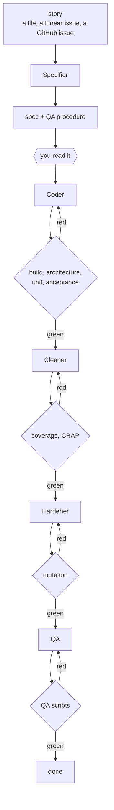

# agent-gauntlet

Let coding agents write code without reading every line yourself.

You define the gates: build, tests, coverage, mutation testing, architecture rules. Agents
work until every gate passes. `./gauntlet.sh` exits 0 or it doesn't, and no model gets a
vote.

Works with any language. Ships with a Java example.



The only place you're needed is the diamond near the top. Everything below it is a machine
deciding.

## Install

```sh
git clone https://github.com/robydrupo/agent-gauntlet.git
cd agent-gauntlet
./install.sh /path/to/your/project
```

Copies the runner, two tools, five agent definitions and one skill. Won't overwrite files
you've already edited.

## Set it up

Three files to write.

**`gauntlet.conf`** — your gates. A gate is a shell function that exits 0 or non-zero.

```sh
GATES=(
  "unit|unit tests"
  "mutation|mutation testing"
)

gate_unit()     { pytest -q; }
gate_mutation() { mutmut run; }

STAGE_CODER="unit"
STAGE_HARDENER="unit mutation"
```

Stages say which gates each agent has to pass before it's allowed to stop.

**`architecture.md`** — your modules, which may depend on which, and how the system is
invoked. Agents read this file. Back the dependency rules with a real tool (ArchUnit,
import-linter, dependency-cruiser) or they're just suggestions.

**`docs/stories/01-*.md`** — what you want, in your own words.

Stories don't have to be files you type. Define `fetch_story()` in `gauntlet.conf` and
`./gauntlet.sh --fetch-story 42` pulls one in from wherever you keep them:

```sh
fetch_story() {
  local id="$1" out
  out="$STORY_DIR/$id-$(gh issue view "$id" --json title -q .title \
        | tr '[:upper:] ' '[:lower:]-' | tr -cd 'a-z0-9-').md"
  gh issue view "$id" --json title,body -q '"# Story \(.title)\n\n\(.body)"' > "$out"
  echo "$out"
}
```

Swap `gh` for a `curl` against Linear's API, a Jira export, or nothing at all. The Specifier
gets a markdown file and never learns where it came from, so changing the source costs you
nothing downstream. `gauntlet.conf.example` has a Linear version.

Then:

```sh
tools/check-referee.sh --regenerate
./gauntlet.sh --list       # check the gates look right
./gauntlet.sh              # red, and it tells you why
```

## Run it

```sh
/run-loop 01
```

Five agents run in order:

| Agent | Job | Done when |
|-------|-----|-----------|
| Specifier | story → spec + QA procedure | you've read it |
| Coder | spec → code + unit tests | `--stage coder` is green |
| Cleaner | refactor, bring CRAP down | `--stage cleaner` is green |
| Hardener | kill surviving mutants | `--stage hardener` is green |
| QA | QA procedure → executable script | the whole gauntlet is green |

Each agent sees only what it needs. The Coder never reads the story, because the spec is its
requirements document and two sources of truth will disagree. The QA agent never reads the
unit tests, because it's the independent check. The rules are in `agents/`.

`/run-loop` dispatches them and re-runs the gates itself after each one, so an agent that
claims success but left a gate red gets sent back. It stops to ask you once: after the
Specifier, if the Specifier flagged something the story didn't answer. Nothing can check a
spec against what you meant, so that part stays yours.

You can also drive them by hand — `use the coder agent`, and so on.

## What a run looks like

You write `docs/stories/01-word-wrap.md`, in your own words:

> Break lines at spaces where you can. A word shouldn't be cut in half just because the line
> was nearly full. If a single word is longer than the width, you have no choice: break it.
> A width of zero makes no sense to me — I'd rather the system refuse than guess.

**Specifier** turns that into `specs/01-word-wrap.feature`:

```gherkin
Scenario Outline: wrapping text to a width
  Given the text "<text>"
  When I wrap it to a width of <width>
  Then I should get the lines:
    """
    <result>
    """
  Examples:
    | text                | width | result                 |
    | hello world         | 5     | hello\nworld           |
    | abcdefghijk         | 5     | abcde\nfghij\nk        |

Scenario: a width of zero is refused
```

plus `specs/qa/01-word-wrap.md` in prose, for a human tester. You read both. This is the
only step with no gate behind it.

**Coder** writes `WordWrapper`, its unit tests, and the glue that runs the scenarios. Then
`--stage coder`, which is green on the second try — the first missed the case where a word
lands exactly on the boundary.

**Cleaner** runs `--stage cleaner` and gets a table:

```
  METHOD                                    CPLX     COV     CRAP
  wordwrap.cli.Main.main                       2      0%     6.00
  wordwrap.domain.WordWrapper.wrap             3    100%     3.00
  wordwrap.domain.WordWrapper.breakPoint       2    100%     2.00

  CRAP OK: 6 method(s), all at or below threshold 30.
```

**Hardener** runs the mutation gate. PIT changes `lastSpace > 0` to `lastSpace >= 0` and the
tests still pass, so that mutant survives and the gate is red. It adds the test that pins a
leading space, and the score goes to 100%.

**QA** turns the prose procedure into `qa/01-word-wrap.sh` — pipe text into the built binary,
diff stdout against a golden file, check the exit code. It never imports the code.

Then the whole gauntlet runs once more, green, and you're done.

## Gates

```sh
./gauntlet.sh                  # all of them, stops at the first failure
./gauntlet.sh mutation         # one, by name
./gauntlet.sh --stage coder    # one agent's set
```

The reference set, wired up in `examples/java-maven`:

| # | Gate | Decides | Java tool |
|---|------|---------|-----------|
| 0 | referee | the gates haven't been edited | `sha256` |
| 1 | compile | it builds | javac |
| 2 | architecture | modules depend only on what they may | ArchUnit |
| 3 | unit | the units behave | JUnit 5 |
| 4 | acceptance | the spec is satisfied | Cucumber |
| 5 | coverage | a hard number is met | JaCoCo |
| 6 | CRAP | no method is both complex and untested | `tools/crap.py` |
| 7 | mutation | the tests verify something | PIT |
| 8 | QA | the built system works from outside | bash + diff |

Gate 0 checksums the files that define the other gates — the runner, the config, the build
file, `architecture.md`, the stories. If an agent lowers a threshold to get past gate 7, the
run goes red. Re-bless deliberate changes with `tools/check-referee.sh --regenerate`.

`docs/GATES.md` explains each gate and lists the equivalent tools for Python, TypeScript, Go
and Rust.

## Try the example

```sh
cd examples/java-maven
./gauntlet.sh            # nine gates, ~11s
./prove-gates-bite.sh    # break it three ways, watch the gates catch it
./reset.sh               # delete the agents' work, then /run-loop 01
```

Run `prove-gates-bite.sh` first. Its third case swaps in tests that call every line and
assert nothing. They pass 100% line coverage, 100% branch coverage, and CRAP. Mutation
testing scores them 56% and the run goes red.

That's the case worth understanding before you rely on any of this.

## Other languages

Every gate is a shell function, so porting is mostly swapping commands. `templates/` has
starting configs for Rust and Python:

```sh
cp templates/gauntlet.conf.rust /path/to/project/gauntlet.conf
```

Six of the eight gates are a one-line change:

| Gate | Java | Rust | Python |
|------|------|------|--------|
| build | `mvn compile` | `cargo clippy -- -D warnings` | `ruff check && mypy` |
| unit | JUnit | `cargo test --lib` | `pytest` |
| acceptance | Cucumber | cucumber-rs | behave |
| coverage | JaCoCo | cargo-llvm-cov | coverage.py |
| mutation | PIT | cargo-mutants | mutmut |
| QA | bash + diff | bash + diff | bash + diff |

Two need thought:

**Architecture** varies by ecosystem. Java has ArchUnit, Python has import-linter, TypeScript
has dependency-cruiser. Rust has nothing equivalent and barely needs one — a crate can't use
another unless `Cargo.toml` says so, so the gate just checks nobody added the dependency and
that the pure crate stays pure. That check is 15 lines of `grep` and it works.

**CRAP** is the only real gap. It needs per-function complexity *and* per-function coverage
in one report, which JaCoCo gives you and most other toolchains don't. Outside Java you
either join two tools yourself (`radon cc --json` + `coverage json`) or substitute a plain
complexity ceiling, which is weaker but still deterministic. Both templates show how.

The Rust config was smoke-tested on a real workspace: build, architecture, unit and QA gates
run, and putting a `println!` in the pure crate turns gate 2 red. The coverage and mutation
gates are written but untested, because they need `cargo-llvm-cov` and `cargo-mutants`
installed.

## Limits

- Nothing checks the specification. Read it.
- Gate 0 stops shortcuts, not determined cheating. An agent that edits the build file *and*
  the checksum file gets through. Use a CI check on protected paths if that matters.
- 100% mutation coverage is only realistic scoped to a module. The example scopes it to the
  domain and covers the adapter with QA scripts instead. Thresholds you can't hit get
  lowered, and a lowered threshold is a dead gate.

## Requirements

bash 3.2, Python 3, `shasum`. Gates call whatever you point them at. The Java example needs
JDK 17 and Maven.

MIT.
